# 维护架构图

本文档给维护者和后续 agent 使用。目标是用函数级 Mermaid 图说明当前实现，不写用户个人网络环境，也不写普通使用教程。

当前代码仍是 OpenClaw 插件形态。跨框架适配时，优先把下面图里的 OpenClaw 专有函数收口到 `HostAdapter`，不要继续在 `src/provider.ts` 里堆宿主分支。

## 1. 顶层运行时边界

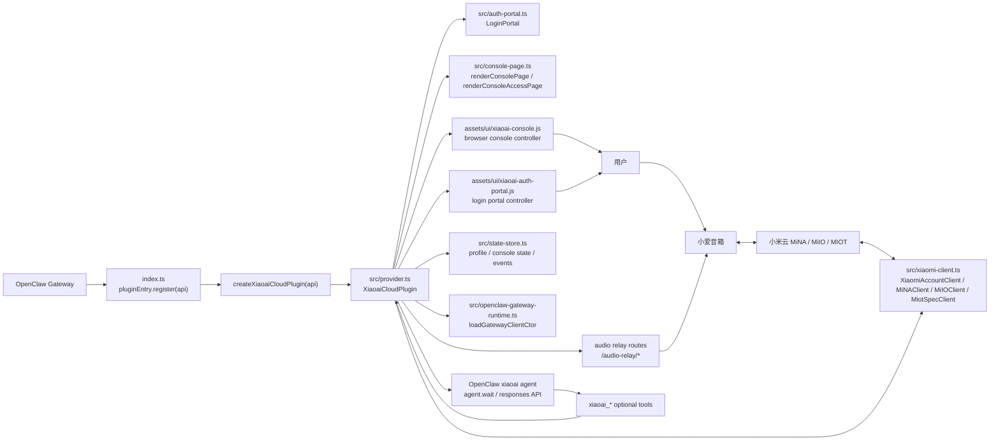

## 2. 插件启动和停止生命周期

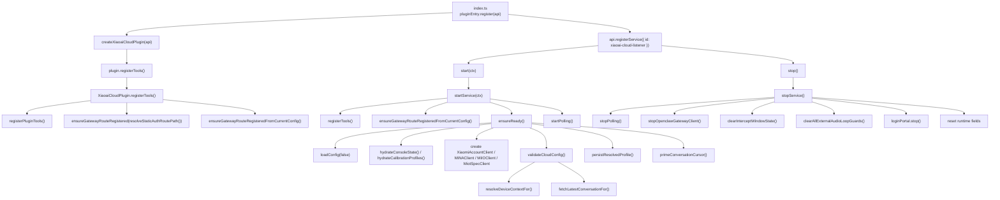

适配提示：

- `index.ts`、`api.registerService`、`api.registerTool` 是 OpenClaw 宿主边界。
- `ensureReady()` 之后的 Xiaomi 客户端初始化属于核心能力，应迁移到 core/app。
- `startPolling()` 是语音入口能力，不应绑定到 OpenClaw。

## 3. HTTP 路由分发

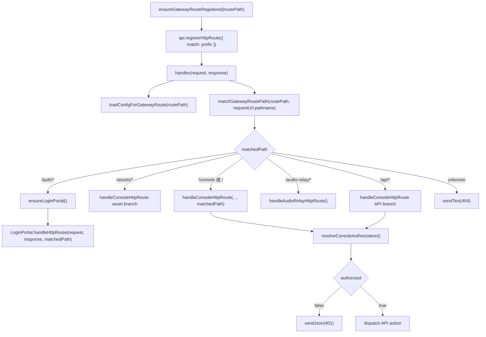

## 4. 登录门户与二次验证

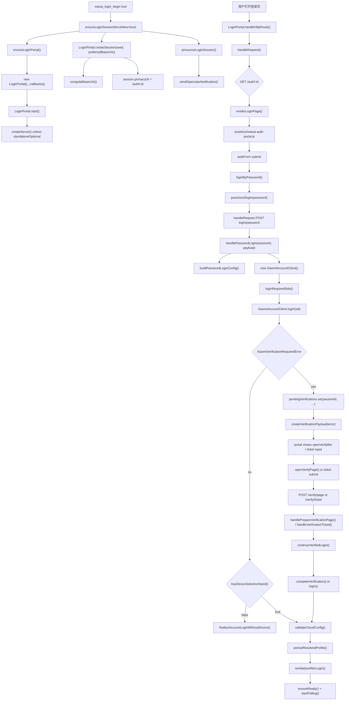

关键兜底：

- `renderLoginPage()` 的登录按钮是 `type="submit"`。
- JS 正常时走 `postJson()`。
- JS 失败时走原生 form POST，`handleRequest()` 用 `isHtmlFormRequest()` 判断后 `sendRedirect()` 回登录页。

## 5. 小米客户端分层

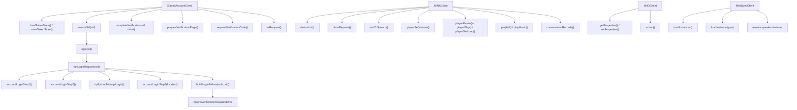

适配提示：

- `XiaomiAccountClient`、`MiNAClient`、`MiIOClient`、`MiotSpecClient` 是宿主无关核心。
- 这些类不应该依赖 OpenClaw、PicoClaw、ZeroClaw、Hermes。

## 6. 对话轮询与拦截主链路

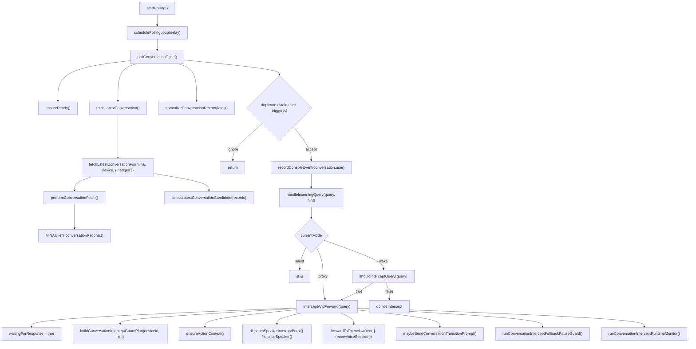

防循环关键函数：

- `rememberSelfTriggeredQuery(text, source)`
- `shouldIgnoreSelfTriggeredQuery(query, queryTimeMs)`
- `pruneRecentSelfTriggeredQueries(nowMs)`
- `recordVoiceContextTurn(role, text, sessionKey)`
- `buildVoiceContextPrompt(sessionKey)`

## 7. OpenClaw agent 投递链路

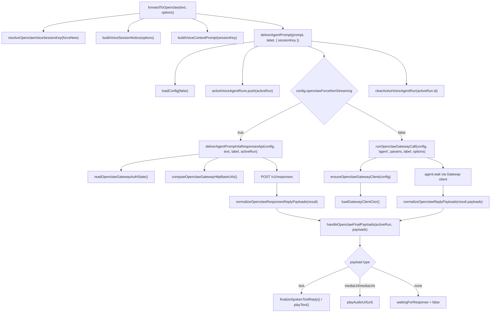

适配提示：

- 上图整段是 OpenClaw adapter 候选边界。
- 新宿主只需要实现统一的 `invokeAgent()` / `waitAgent()` / `sendUserNotification()`，不应该复制 `x-openclaw-*` 细节。

## 8. 工具注册与工具执行

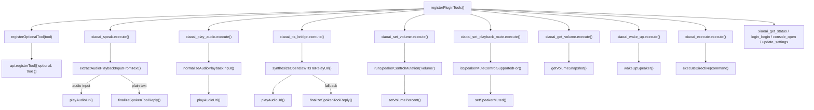

跨宿主适配时，工具 schema 应迁移为宿主无关 `HostToolDefinition[]`，再由各宿主 adapter 转换。

## 9. 文本播报链路

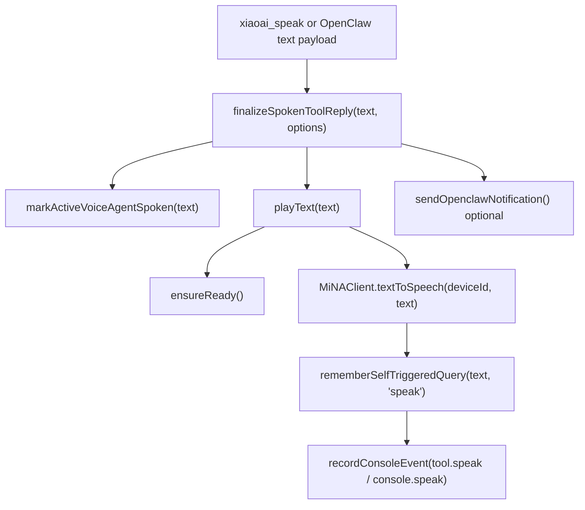

## 10. 音频播放、relay 与防循环

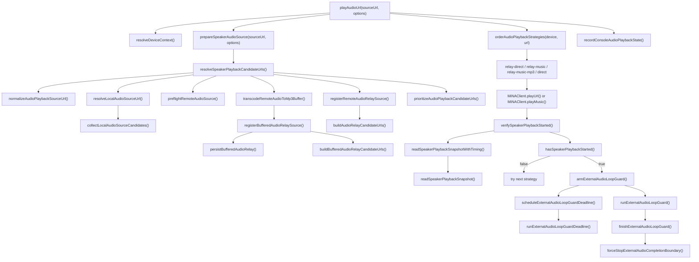

relay HTTP 路由：

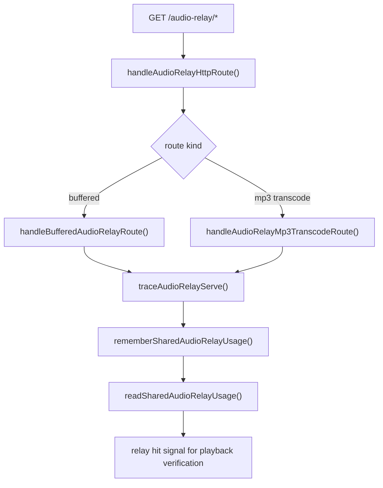

短音频和外部音频相关函数：

- `computeDynamicExternalAudioLoopGuardBaseLeadMs(deviceId)`
- `computeExternalAudioLoopGuardLeadMs(deviceId, options)`
- `computeRelayHitAnchoredExternalAudioDeadlineAtMs(...)`
- `shouldAcceptRelayHitStart(...)`
- `detectSpeakerPlaybackBootstrapReason(...)`
- `isSpeakerPlaybackStalledQueued(...)`

## 11. 音量、静音和设备控制

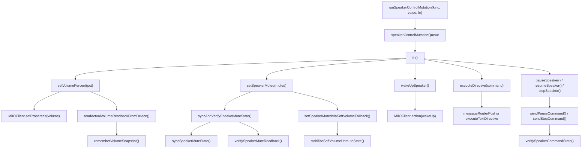

## 12. 控制台后端 API

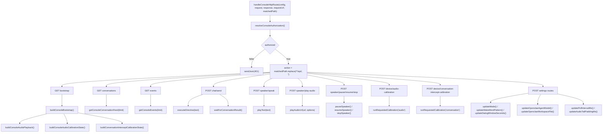

控制台前端主要入口：

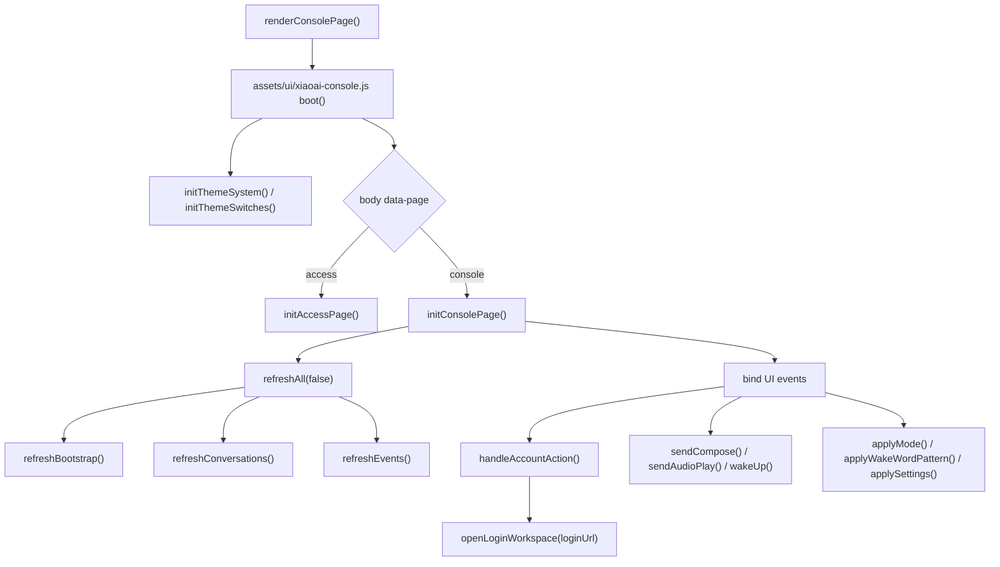

## 13. 状态持久化

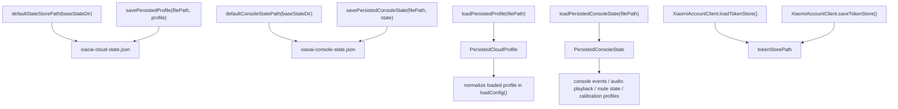

状态边界：

- 小米 token 属于 secret/state，不能进 prompt、memory 或日志明文。
- 控制台 token 和登录 session 有过期时间。
- 音频 relay 缓存必须可裁剪。

## 14. 跨宿主拆分目标

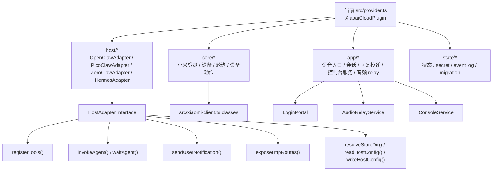

拆分规则：

- `OpenClaw` 字样只能出现在 `host/openclaw-*`、安装脚本和兼容文档里。
- `core/*` 不能 import 宿主 SDK。
- `app/*` 只能通过 `HostAdapter` 调宿主。
- `state/*` 只处理路径、读写、迁移、脱敏。

## 15. 维护检查清单

- 改登录页前，检查 `renderLoginPage()`、`assets/ui/xiaoai-auth-portal.js`、`LoginPortal.handleRequest()` 三处是否一致。
- 改控制台前，检查 `renderConsolePage()`、`assets/ui/xiaoai-console.js`、`handleConsoleHttpRoute()` 三处是否一致。
- 改音频播放前，检查 `playAudioUrl()`、relay route、`verifySpeakerPlaybackStarted()`、loop guard 四条链路。
- 改会话转发前，检查 `forwardToOpenclaw()`、`deliverAgentPrompt()`、`handleOpenclawFinalPayloads()`、`recordVoiceContextTurn()`。
- 改安装和发布前，检查 `package.json files`、`openclaw.plugin.json`、`install.sh`、`scripts/configure-openclaw-install.mjs`、GitHub Action。
- 做跨宿主适配前，先读 `CROSS_CLAW_ADAPTATION_PLAN.md`，不要直接让新宿主加载 OpenClaw 插件入口。
